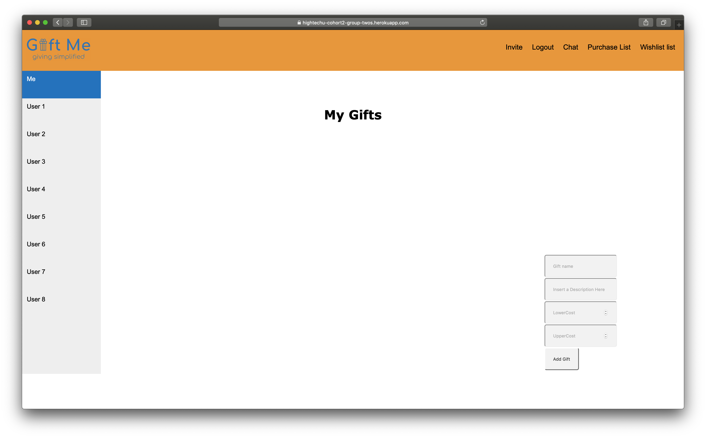

# Gift Me

**2019 HighTechU Academy - Cohort 2**

## Website

https://hightechu-giftme.herokuapp.com/chat.html

## Mini Pitch

This will be a great way for friends and families to organize gifts during holidays.

## Problem Statment

Holidays can become a complicated time with regards to preparing and organizing gifts for family members and friend circles.

## User Stories

* As an autheticated user, I want to suggest gifts I want to provide ideas or inspiration for the chat members.
* As an autheticated user, I want to be able to communicate with other users to discuss gift ideas.
* As an user, I want to be able to identify myself ao that people know who is getting what.
* As a chat creator, I want to be able to invite my friends or family so we can chat.
* As a autheticated user, I want to be able to navigate the site so I can switch between tasks.
* As a autheticated user, I want to be able to add to a list of gifts to keep track of ideas.

## Website Pages

* Landing Page -> `register.html`
* Login Page -> `login.html`
* Chat Page -> `chat.html`
* List of Gifts Page -> `giftlist.html`
* Gift Suggestions Page -> `giftsuggest.html`
* Invite Page -> `invite.html`
* Accept Invitation Page -> `acceptinvite.html`
* Partial Page: Navigation Bar -> `navbar.html`

## Promo

## Made with:

* HTML
* CSS
* JS
* Loopback

## Made by:

* Anish
* Ines
* Nicolas
* Ryan
